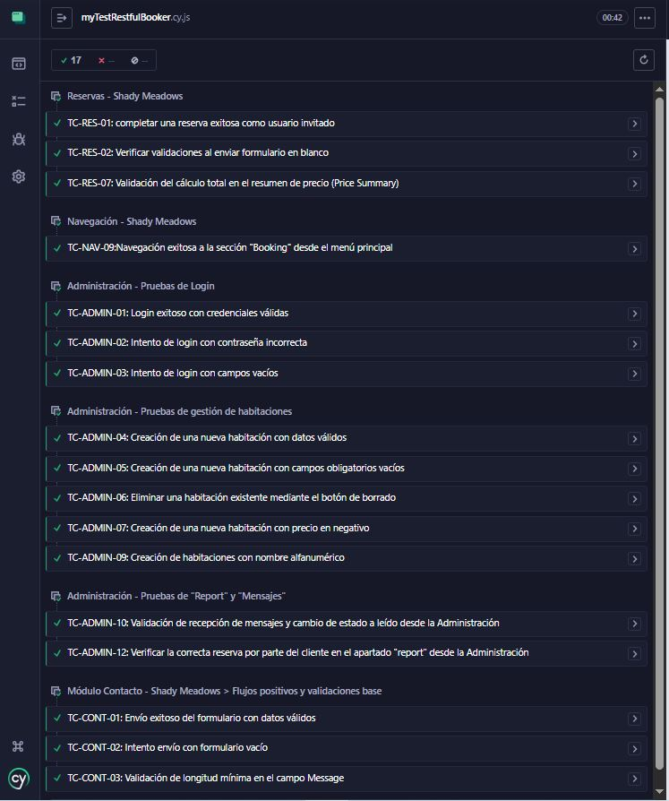

# 🚀 Challenge de Cypress Automation | XAcademy - Technology con Propósito

Bienvenido al repositorio oficial del **Grupo 19** para el Trabajo Final de la Cohorte I - 2026. En este proyecto ponemos en práctica los conocimientos adquiridos de QA Automation aplicando pruebas End-to-End (E2E) sobre el sistema web real de reservas de un Bed & Breakfast: [Shady Meadows](https://automationintesting.online/).

---

## 🔗 Enlaces Importantes de Documentación

Para cumplir con los criterios de evaluación, toda nuestra documentación técnica está centralizada en los siguientes enlaces:

* 📄 **[Plan de Pruebas (Casos de Prueba)](https://docs.google.com/spreadsheets/d/1HvECogJ3xM9bXqu5aTH7l92xTlssPBjfWKN74BWISFI/edit?gid=1611920195#gid=1611920195)**: Documento detallado en Drive con la redacción de escenarios positivos, negativos y de borde.
* 🐞 **[Tablero de Bugs (Trello)](https://trello.com/invite/b/6a2b29b40986c4a96b7e7842/ATTI491d39acad953056a71f3f9f80b0b8698CDBE2AE/grupo-19-challenge)**: Gestión y reporte de los defectos encontrados en la aplicación.
* 🌐 **[Entorno de Pruebas](https://automationintesting.online/)**: Aplicación web testeada.
* 📋 **[Consigna del Challenge](https://drive.google.com/file/d/1Nhhz3rIxxQguuZFb5Fm_fAJPHPUruhgg/view)**: Requisitos del proyecto.

---

## 👥 Integrantes del Equipo + Emails (Grupo 19)

* Hilen Ortiz
  - hilensortiz@gmail.com
* Milagros Escarlon
  - milagrosescarln@yahoo.com.ar
* Natacha Rodriguez
  - natacharodriguez.it@gmail.com
* Rocio Vera López
  - rochioveralopez@gmail.com

---

## 🎯 Escenarios Automatizados

Nuestra suite principal abarca el 100% de los flujos requeridos, diseñados con la premisa de Test Isolation para que cada prueba se ejecute de forma hermética e independiente:

1. **Reserva exitosa y validaciones:** Generación dinámica de fechas, verificación del *Price Summary* e intentos de envío con campos vacíos.
2. **Formulario de Contacto:** Llenado y envío de mensajes, validando confirmaciones exitosas (Status 200) y mensajes de error por formato y longitud.
3. **Panel de Administración:** Flujos de Login, lectura de notificaciones, y creación/eliminación de habitaciones generando data temporal propia.
4. **Navegación UI/UX:** Comprobación de *smooth scroll* y visibilidad de las secciones.

---

## 🛠️ Tecnologías y Herramientas Utilizadas

* **[Cypress](https://www.cypress.io/)**: Framework E2E principal.
* **[JavaScript](https://developer.mozilla.org/es/docs/Web/JavaScript)**: Lenguaje base de la automatización.
* **[Node.js](https://nodejs.org/)**: Entorno de ejecución.
* **Patrones Implementados:** Data-Driven Testing (Fixtures) y Custom Commands.

---

## 📁 Estructura del Proyecto

* 📁 **`cypress/e2e/`**: Contiene la suite central de pruebas.
* 📁 **`cypress/fixtures/`**: Archivos JSON estáticos (`datosHotel.json`, `contacto.json`) para parametrizar la data.
* 📁 **`cypress/support/`**: Comandos personalizados (`commands.js`) para abstraer lógicas repetitivas y robustecer el código.
* 📄 **`cypress.config.js`**: Configuración global de la herramienta.

---

## 📊 Resultados de la Automatización

A continuación, se evidencia la ejecución exitosa de la suite completa de pruebas, demostrando la estabilidad y el correcto funcionamiento de todos los flujos E2E:

*Suite de Cypress: 17/17 tests aprobados (100% de éxito).*

---

## 🚀 Cómo ejecutar las pruebas localmente

1. Clona este repositorio: `git clone [url-del-repo]`
2. Instala las dependencias: `npm install`
3. Abre la interfaz gráfica: `npx cypress open`
4. Ejecuta en consola (headless): `npx cypress run`

---
**📅 Fecha Límite de Entrega:** 25/06/2026 | *Este repositorio es de acceso público.*
